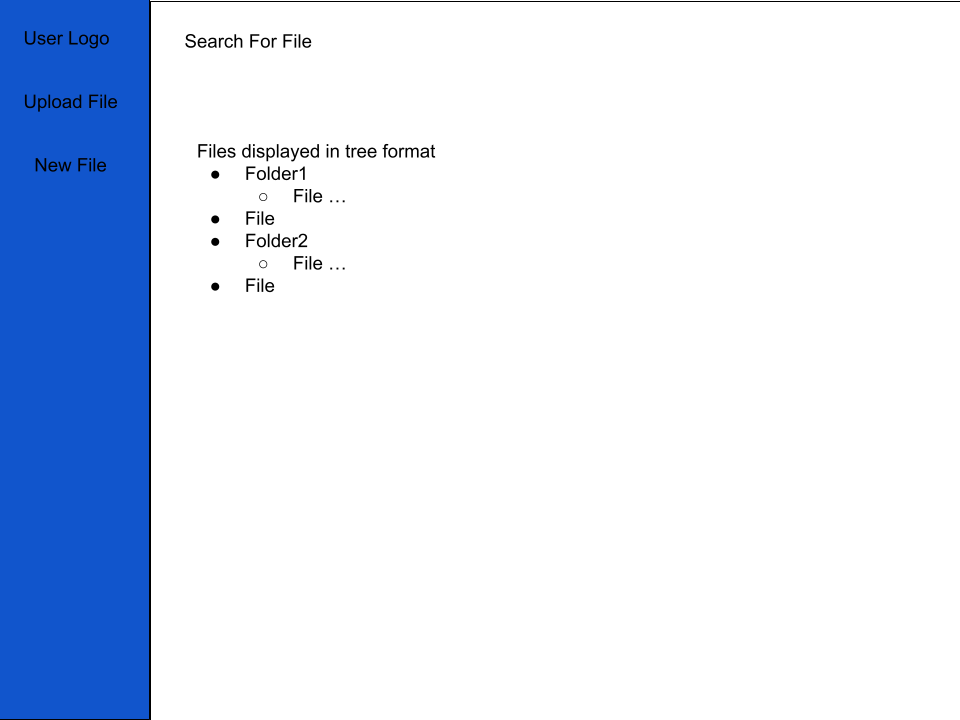
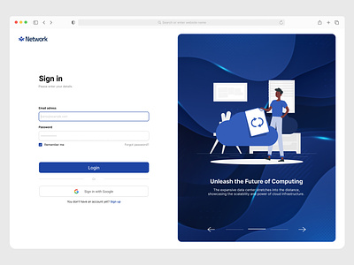

# Home Inventory App
The Home Inventory App is meant to house files related to a person's belongings or any other related information. 

>The goal of this project is to build a useful application in order to better understand the software engineering process used to build and maintain an application. 

# Table of Contents

1. [Objectives](#objectives)
2. [Technologies](#technologies)
3. [Getting Started](#getting-started)
4. [Design](#design)
5. [What I learned](#what-i-learned)
6. [Improvements](#improvements)
7. [Credits](#credits)

## **Objectives**

The goal of better understanding the software design process through this project will take place in a multitude of different ways:
- Creating a Design Document of the desired Views and software architecture
    - A Design Document indicating the end goals of the project along with the software architecture helps to give direction to this project. It works as a general guideline to help people new and old to understand the inner-workings of this project and the overall intent and design choices made
- Use of Test Driven Development
    - TDD requires writing and updating tests for every feature implemented and bug fixed. This forces us to have a good understanding of the requirements needed to complete the intended objective before writing code. Additionally, unit tests are a great documentation tool that tell us how certain functionality is expected to be used 
- Writing of Unit/Integration/GUI tests
    - Testing is an important part of writing good working code. Unit tests provides great documentation while also ensuring code works as expected
- Employing OOP Design Patterns and SOLID Principles
    - Design patterns and SOLID principles allow for a clean consistent design of code structure. These principles and patterns give us more maintainable and modular code
- Beginning with Minimum Viable Product(MVP)
    - Starting with MVP gets something visible displayed instead of just having a theoretical model in design documents. MVP gives a skeleton to work off of and iterate on further in the future
- Write Clean Code
    - Clean Code is one of the major steps to writing good code as it makes it easier to understand and read parts of code for all developers. Clean code helps to understand what the code is doing and why the code is doing it.

## **Technologies**

In this application, several technologies are used:
1. Spring Boot/Spring MVC
    - These are frameworks used to facilitate the architecture of our code to provide a web based GUI
2. Elastic Search
    - Elastic Search allows us to search on files for specific file names and content
3. MongoDB
    - This NoSQL database allows us to store files and file structure
4. Docker
    - Containerization allows us to easily transfer working code from one machine to another without worrying about problems specific to machinery
5. AWS
    - AWS provides us a way to deploy our code for production use
6. GitHub Actions
    - Github Actions allows us to create a CI/CD pipeline allowing for faster Time to Market
7. JUnit/Other testing Frameworks like Selenium
    - These Frameworks are used to test our code to ensure the project works as intended
8. Github Issues
    - Github Issues allows us to track progress within our code base. It allows to put in writing design features and bugs

## **Getting Started**

Content for section

## **Design**

The idea for this project is to create a *file system* similar to Windows file explorer or even Linux. Therefore, we would display a *tree structure* of the *files and folders*. Files can be imported or created. Files also can be searched on either by title or by content. In effect, this is similar to how Google Drive or One Drive works, however, much less sophisticated. There will also be a *login feature* for differrent users to have different sets of files.

<u>We will have a screen for the login and a screen for the file system and search</u>

The search feature will include a search bar. This search bar allows users to query for files by title and content. Matching files will be displayed through a scrollable modal for one time use similar to that of Google Drive. On the side, there will be the user logo for logout and to display the user as well as a button to upload a file of <strike>any type</strike> select type and the option to create a basic text file. The tree display will display the logo. All files will be opened up in a new tab.

Our login screen look something like this: . Our initial implementation should be relatively basic. It should not contain any notion of encryption or have sign in with google be functional.

>*The initial design shall be focused on getting the login screen working and the file system and search done as desired*

The user workflow shall work as having the user 
1. login 
2. file system and search

Internally, an MVC design approach shall be used. MVC consists of
1. Controller
    - LoginController(*Used for login*)
    - SearchController(*Used to search file*)
2. Model
    - File Model
    - Directory Model
    - Search Model
    - Hit Model
3. View
    - Login View
    - SideBar View
    - Search View
    - File System View

As mentioned above, MongoDB is used to store files while Elastic Search will be used to store these files

## **What I Learned**

Content for section

## **Improvements**

Content for section

## **Credits**

Content for section
